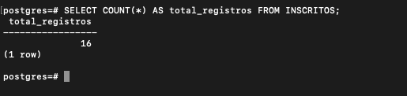
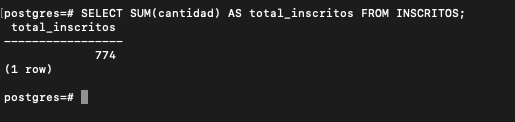
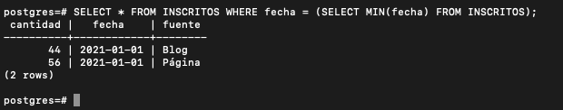
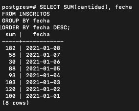
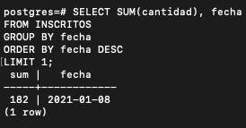
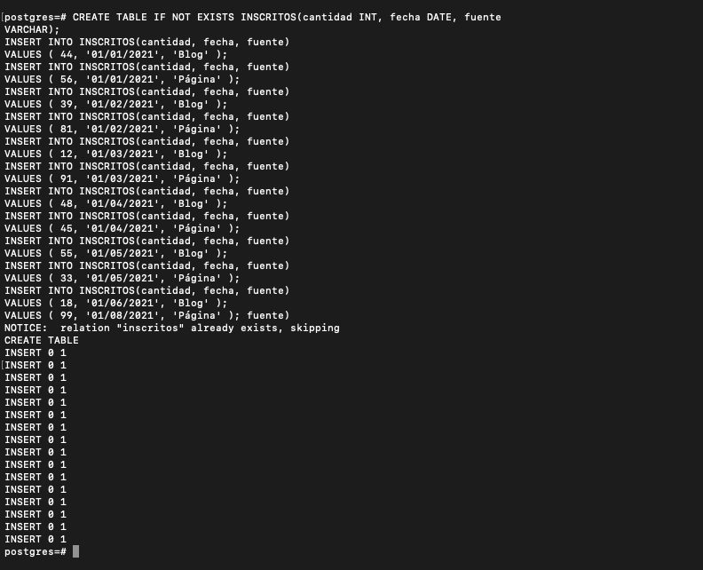

# Author: 
Eduardo Marval

# Date: 
10 April, 2023

# Title: 
Desafío - Manipulación de datos y
transaccionalidad en las operaciones

# Description:
Aplicando los conceptos y herramientas aprendidas hasta ahora, crea las querys SQL necesarias que contesten las siguientes preguntas.

1. ¿Cuántos registros hay?

2. ¿Cuántos inscritos hay en total?

3. ¿Cuál o cuáles son los registros de mayor antigüedad?

4. ¿Cuántos inscritos hay por día? (entendiendo un día como una fecha distinta de
ahora en adelante)

5. ¿Qué día se inscribieron la mayor cantidad de personas y cuántas personas se
inscribieron en ese día?

# Requirements:

Utilizando el siguiente set de datos:

- CREATE TABLE IF NOT EXISTS INSCRITOS(cantidad INT, fecha DATE, fuente VARCHAR);

- INSERT INTO INSCRITOS(cantidad, fecha, fuente)
VALUES ( 44, '01/01/2021', 'Blog' );

- INSERT INTO INSCRITOS(cantidad, fecha, fuente)
VALUES ( 56, '01/01/2021', 'Página' );

- INSERT INTO INSCRITOS(cantidad, fecha, fuente)
VALUES ( 39, '01/02/2021', 'Blog' );

- INSERT INTO INSCRITOS(cantidad, fecha, fuente)
VALUES ( 81, '01/02/2021', 'Página' );

- INSERT INTO INSCRITOS(cantidad, fecha, fuente)
VALUES ( 12, '01/03/2021', 'Blog' );

- INSERT INTO INSCRITOS(cantidad, fecha, fuente)
VALUES ( 91, '01/03/2021', 'Página' );

- INSERT INTO INSCRITOS(cantidad, fecha, fuente)
VALUES ( 48, '01/04/2021', 'Blog' );

- INSERT INTO INSCRITOS(cantidad, fecha, fuente)
VALUES ( 45, '01/04/2021', 'Página' );

- INSERT INTO INSCRITOS(cantidad, fecha, fuente)
VALUES ( 55, '01/05/2021', 'Blog' );

- INSERT INTO INSCRITOS(cantidad, fecha, fuente)
VALUES ( 33, '01/05/2021', 'Página' );

- INSERT INTO INSCRITOS(cantidad, fecha, fuente)
VALUES ( 18, '01/06/2021', 'Blog' );

- INSERT INTO INSCRITOS(cantidad, fecha, fuente)
VALUES ( 12, '01/06/2021', 'Página' );

- INSERT INTO INSCRITOS(cantidad, fecha, fuente)
VALUES ( 34, '01/07/2021', 'Blog' );

- INSERT INTO INSCRITOS(cantidad, fecha, fuente)
VALUES ( 24, '01/07/2021', 'Página' );

- INSERT INTO INSCRITOS(cantidad, fecha, fuente)
VALUES ( 83, '01/08/2021', 'Blog' );

- INSERT INTO INSCRITOS(cantidad, fecha, fuente)
VALUES ( 99, '01/08/2021', 'Página' );

- Cada consulta declarada en la descripción tiene un valor de 2 puntos para un total de (10 puntos).

● /assets/img para las imágenes.
● /mdd.sql.
● /README.MD

